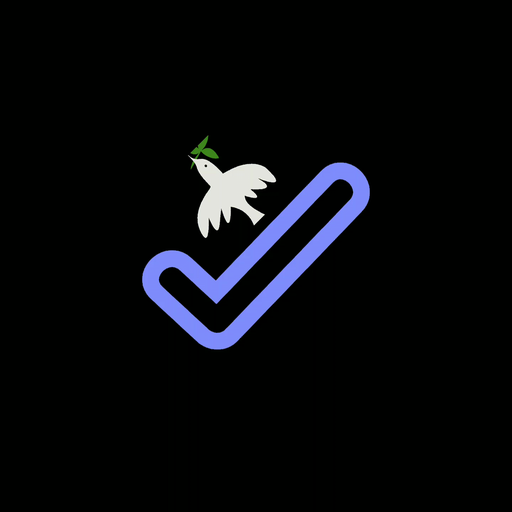

# Get Done ✅
<div align="center">
  
  <h3>Your All-in-One Productivity Companion</h3>
  <p><em>Notes • Tasks • Focus Timer - Everything you need to stay productive</em></p>

  [](https://github.com/kafilcodes/Get_Done)
  [](https://flutter.dev/)
  [](LICENSE)
  []()
  
  [🚀 Features](#features) •
  [🎯 Solutions](#real-world-solutions) •
  [🛠️ Tech Stack](#tech-stack) •
  [📱 Download](#download-app) •
  [🔮 Roadmap](#future-roadmap)
</div>

---

## 🌟 Overview

Get Done is a comprehensive productivity suite designed to help you organize your thoughts, manage your tasks, and maintain focus. With seamless cloud synchronization, cross-platform availability, and intuitive design, Get Done brings together everything you need to stay productive in one beautifully crafted application.

## ✨ Key Features

### 📝 Smart Notes
- **Rich Text Editing** - Format your notes with style
- **Cloud Sync** - Access your notes anywhere, anytime
- **Categories & Tags** - Organize notes your way
- **Search & Filter** - Find notes instantly
- **Share & Export** - Collaborate with ease

### ✓ Modern Todo
- **Smart Tasks** - Create and manage tasks effortlessly
- **Push Notifications** - Never miss a deadline
- **Custom Reminders** - Set your schedule
- **Priority Levels** - Focus on what matters
- **Progress Tracking** - Visual task completion

### ⏱️ Pomodoro Focus Timer
- **Customizable Intervals** - Work & break durations
- **Focus Sounds** - Ambient noise & white noise
- **Session Statistics** - Track your productivity
- **Auto Break Timer** - Maintain work-life balance
- **Focus Mode** - Eliminate distractions

## 🎯 Real-World Solutions

| Challenge | Solution |
|-----------|----------|
| Information Overload | Organized note-taking system |
| Task Management | Smart todo with priorities |
| Procrastination | Pomodoro timer with focus sounds |
| Work-Life Balance | Scheduled breaks & reminders |
| Cross-Device Access | Cloud sync across platforms |

## 🛠️ Technical Architecture

### Tech Stack
- **Frontend**: Flutter & Dart
- **Backend**: Firebase Services
  - Firestore
  - Realtime Database
  - Firebase Auth
- **Storage**: Firebase Cloud Storage
- **Monetization**: Google AdMob

### Key Dependencies
```yaml
dependencies:
  flutter:
    sdk: flutter
  firebase_core: ^2.4.1
  cloud_firestore: ^4.3.1
  firebase_auth: ^4.2.5
  google_mobile_ads: ^2.3.0
  shared_preferences: ^2.0.15
  provider: ^6.0.5
  flutter_local_notifications: ^13.0.0
```

## 🚀 Getting Started

1. **Clone the repository**
```bash
git clone https://github.com/kafilcodes/Get_Done.git
```

2. **Install dependencies**
```bash
flutter pub get
```

3. **Configure Firebase**
- Create a Firebase project
- Add your `google-services.json` (Android) and `GoogleService-Info.plist` (iOS)
- Enable Authentication and Firestore

4. **Set up AdMob**
- Create an AdMob account
- Add your app ID to the manifest
- Configure ad units

5. **Run the app**
```bash
flutter run
```

## 📱 Download App

> ⚠️ Note: The app was previously available on the Google Play Store but might be currently disabled.
- [Google Play Store](https://play.google.com/store/apps/details?id=com.kcoding.get_done)
- Web Version (Coming Soon)
- iOS Version (Coming Soon)

## 🔮 Future Roadmap

- [ ] Desktop apps (Windows, macOS)
- [ ] Team collaboration features
- [ ] Advanced note templates
- [ ] AI-powered task suggestions
- [ ] Custom themes
- [ ] Offline mode
- [ ] Data analytics & insights
- [ ] Calendar integration

## 👨‍💻 Author

**Mohd. Kafil Khan**

<p align="left">
  <a href="https://github.com/kafilcodes">
    
  </a>
  <a href="https://www.linkedin.com/in/kafilcodes/">
    
  </a>
  <a href="https://twitter.com/_Kafilkhan_">
    
  </a>
</p>

## 📄 License

This project is licensed under the MIT License - see the [LICENSE](https://github.com/kafilcodes/Get-Done---Privacy/blob/main/privacy-policy.md) file for details.

## ☕ Support

If you find this project helpful, consider:

- ⭐ Star the repository
- 🐛 Report issues
- 🤝 Contribute to the project
- ☕ [Buy me a coffee](https://www.buymeacoffee.com/kafilcodes)

---

<div align="center">
  <sub>Built with ❤️ by Kafil Khan</sub>
</div>
